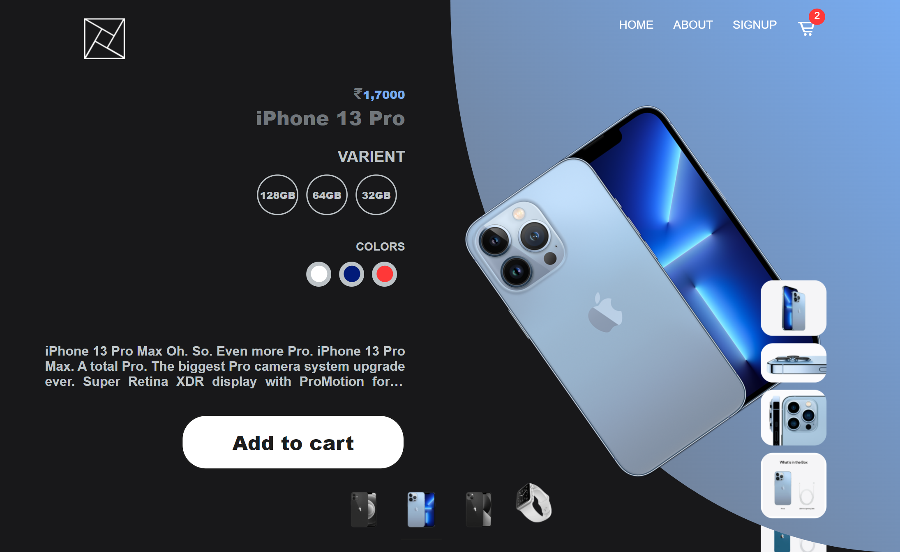
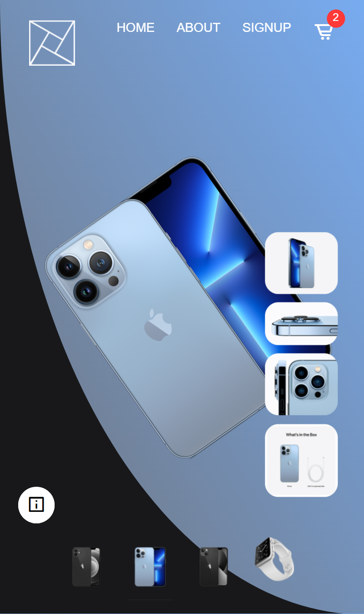
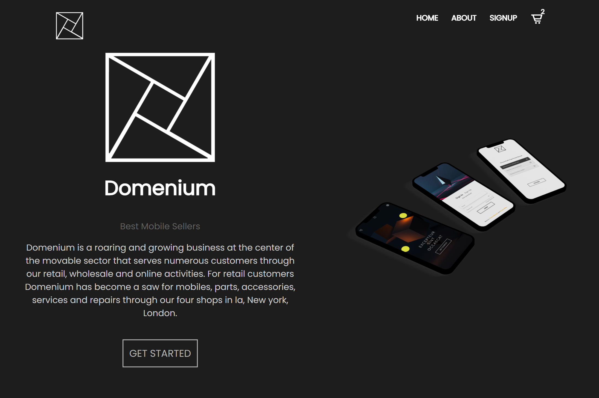
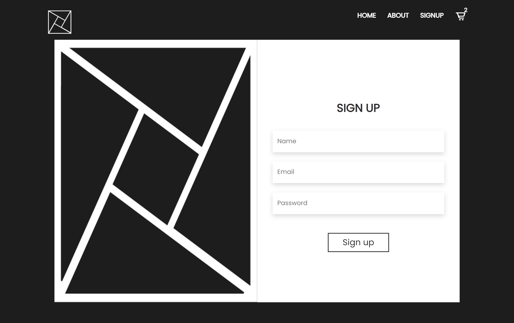

# Domenium

  

 

## Web APP made for VJTI TECHNOVANZA hackathon by Jaydeep Shelake

> WEB TRACK – Design a website for showcasing any electronic gadget.
> Eg : Phone, Tablet, Laptop, Video Game, etc.

## ⚙️ Detailed Functionality

- Website has greate UI and Sick animations and transitions
- It has Great UX as well
- Website is responsive as well

## 🚀 Tech and Tools Used

- HTML , Vanilla CSS (no framework or library) and vanilla javaScript (no framework or library)
- boxicons
- VS code
- GitHub

## Video Link: https://drive.google.com/file/d/1Xxnmqy2uQubZMZS2D-EXfpGzqfreYCIr/view?usp=sharing

## 📸 Screenshots

## Desktop View

 

## Mobile View

 

## About page

 

## About page

 

### Deployment Link : https://jaydeep-shelake.github.io/VJTI_Hackathon/

## Author

Name: Jaydeep Hindurao Shelake  
email: jaydeepshelake10@gmail.com  
LinkedIn: https://www.linkedin.com/in/jaydeep-shelake-a348771b2/
